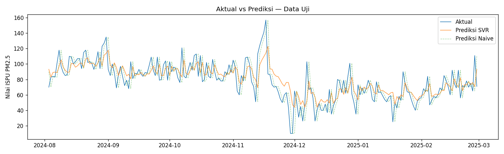

# Peramalan Nilai PM2.5 Harian DKI Jakarta Menggunakan Support Vector Regression dengan Time Series Cross-Validation

### *Daily PM2.5 Value Forecasting for DKI Jakarta Using Support Vector Regression with Time Series Cross-Validation*


## Deskripsi

Proyek ini membangun model **Support Vector Regression (SVR)** berkernel **RBF** untuk meramalkan **nilai PM2.5 harian DKI Jakarta satu hari ke depan** (*one-step-ahead forecasting*), menggunakan data Indeks Standar Pencemar Udara (ISPU) periode 2021–2025. Model dievaluasi dengan validasi yang menjaga urutan waktu (*time series cross-validation*), tanpa kebocoran data, dan dibandingkan dengan baseline *naive (persistence)*.

> **Hasil utama:** [ISI setelah notebook 04 dijalankan — contoh: "SVR mencapai RMSE X pada data uji, dibandingkan Y untuk baseline naive."]

## Notebook

Jalankan berurutan. Klik tombol Colab untuk membuka langsung.

| # | Notebook | Isi | Colab |
|---|---|---|---|
| 1 | [`01_data_wrangling`](01_data_wrangling.ipynb) | Membaca data, memilih periode, memeriksa dan menangani missing value | [](https://colab.research.google.com/github/YudhaAlfarizi/jakarta-pm25-svr-forecasting/blob/main/01_data_wrangling.ipynb) |
| 2 | [`02_eda`](02_eda.ipynb) | Statistik deskriptif, tren, pola bulanan, distribusi, ACF/PACF | [](https://colab.research.google.com/github/YudhaAlfarizi/jakarta-pm25-svr-forecasting/blob/main/02_eda.ipynb) |
| 3 | [`03_feature_engineering`](03_feature_engineering.ipynb) | Fitur lag, rolling mean, fitur musiman, split kronologis latih/uji | [](https://colab.research.google.com/github/YudhaAlfarizi/jakarta-pm25-svr-forecasting/blob/main/03_feature_engineering.ipynb) |
| 4 | [`04_svr_modeling`](04_svr_modeling.ipynb) | Baseline naive, tuning SVR dengan `TimeSeriesSplit`, evaluasi, analisis residual, dan eksperimen variabel polutan tambahan | [](https://colab.research.google.com/github/YudhaAlfarizi/jakarta-pm25-svr-forecasting/blob/main/04_svr_modeling.ipynb) |

## Dokumentasi

- [`docs/dataset.md`](docs/dataset.md) — sumber data, kolom, karakteristik dan masalah kualitas data, cara mengunduh
- [`docs/metodologi.md`](docs/metodologi.md) — alur penelitian, alasan tiap langkah, landasan matematis SVR, referensi

## Tujuan Penelitian

1. Memahami karakteristik dan pola nilai PM2.5 harian DKI Jakarta.
2. Membangun model SVR berbasis *lag features* untuk peramalan satu hari ke depan.
3. Menentukan hyperparameter terbaik (kernel, *C*, *ε*, *γ*) dengan `TimeSeriesSplit`.
4. Mengevaluasi model (RMSE, MAE, sMAPE, R²) terhadap baseline naive.
5. Menganalisis residual untuk melihat pola kesalahan model.
6. Menguji secara empiris apakah variabel polutan lain (PM10, CO, O₃, dll.) menambah akurasi.

## Ringkasan Data

- **Sumber:** Indeks Standar Pencemar Udara (ISPU) DKI Jakarta, diterbitkan Dinas Lingkungan Hidup Provinsi DKI Jakarta melalui portal Satu Data Indonesia
- **File:** `ispu_dki_all.csv`, gabungan data 5 stasiun pemantau kualitas udara (SPKU)
- **Periode dipakai:** 1 Januari 2021 – 28 Februari 2025 (nilai PM2.5 baru tersedia sejak 2021)
- **Target:** `pm25`, yaitu nilai ISPU PM2.5 tertinggi di antara 5 stasiun pada hari tersebut
- **Satuan:** ISPU adalah **angka indeks tanpa satuan** (dikonfirmasi Dinas Lingkungan Hidup DKI Jakarta), bukan konsentrasi µg/m³

Detail lengkap dan angka yang dihasilkan notebook 01: [`docs/dataset.md`](docs/dataset.md).

## Hasil

> Diisi setelah notebook 04 dijalankan.

| Model | RMSE | MAE | sMAPE (%) | R² |
|---|---|---|---|---|
| Naive (persistence) | – | – | – | – |
| **SVR (PM2.5 saja)** | – | – | – | – |
| SVR + CO, O₃ | – | – | – | – |
| SVR + PM10 | – | – | – | – |
| SVR + semua polutan | – | – | – | – |



**Interpretasi:** [ISI: apakah SVR mengalahkan baseline dan seberapa besar selisihnya, apakah variabel tambahan membantu, dan kapan model paling sering meleset.]

## Keterbatasan

- Nilai PM2.5 hanya tersedia ±4 tahun, sehingga siklus musiman teramati terbatas.
- Target adalah nilai tertinggi dari 5 stasiun pada hari itu, bukan pengukuran satu lokasi.
- ISPU adalah angka indeks, bukan konsentrasi fisik, sehingga tidak bisa dibandingkan langsung dengan standar µg/m³ negara lain.
- Periode uji (akhir 2024–awal 2025) cenderung lebih rendah nilainya dibanding data latih.
- Model hanya meramalkan satu langkah ke depan dan tidak memakai variabel meteorologi.

## Struktur Repositori

```
jakarta-pm25-svr-forecasting/
├── data/
│   ├── ispu_dki_all.csv        # data mentah
│   ├── pm25_daily.csv          # hasil notebook 01
│   ├── train.csv                # hasil notebook 03
│   └── test.csv                 # hasil notebook 03
├── docs/
│   ├── dataset.md
│   └── metodologi.md
├── 01_data_wrangling.ipynb
├── 02_eda.ipynb
├── 03_feature_engineering.ipynb
├── 04_svr_modeling.ipynb
├── README.md
├── requirements.txt
└── LICENSE
```

## Cara Menjalankan

**Google Colab (disarankan):** klik tombol Colab di tabel notebook, lalu *Runtime → Run all*, dimulai dari notebook 1.

**Lokal:**

```bash
git clone https://github.com/USERNAME/jakarta-pm25-svr-forecasting.git
cd jakarta-pm25-svr-forecasting
pip install -r requirements.txt
jupyter notebook
```

## Referensi Utama

1. Hyndman, R. J., & Athanasopoulos, G. (2021). *Forecasting: Principles and Practice* (3rd ed.). OTexts. https://otexts.com/fpp3/
2. Smola, A. J., & Schölkopf, B. (2004). A tutorial on support vector regression. *Statistics and Computing*, 14(3).
3. Pedregosa, F., et al. (2011). Scikit-learn: Machine learning in Python. *Journal of Machine Learning Research*, 12.
4. Kementerian Lingkungan Hidup dan Kehutanan Republik Indonesia. Peraturan Menteri LHK No. 14 Tahun 2020 tentang Indeks Standar Pencemar Udara.

Daftar lengkap: [`docs/metodologi.md`](docs/metodologi.md#referensi).

## Penulis

**YudhaAlfarizi** — Lulusan Matematika · [LinkedIn](https://www.linkedin.com/in/yudha-alfarizi-07588a286/) · [Email](yudhaaakerja29072026@gmail.com)

## Lisensi

Kode dirilis di bawah lisensi MIT. Dataset mengikuti lisensi sumber aslinya (kaggle).
