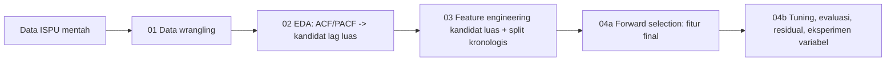

# Metodologi dan Landasan Teori

[← Kembali ke README](../README.md)

## 1. Ringkasan

| Komponen | Rancangan |
|---|---|
| Jenis penelitian | Kuantitatif terapan: peramalan deret waktu satu langkah ke depan (*one-step-ahead*) |
| Model utama | ε-Support Vector Regression dengan kernel RBF |
| Pembanding | Baseline naive (persistence) |
| Validasi tuning | `TimeSeriesSplit` (5 lipatan), pada data latih saja |
| Evaluasi akhir | Data uji kronologis, tidak disentuh saat tuning |
| Fitur utama | Lag `pm25`, rolling mean, fitur musiman siklikal |

## 2. Alur Penelitian



| No | Langkah | Alasan | Sifat | Notebook |
|---|---|---|---|---|
| 1 | Pemahaman data | Menemukan masalah sejak awal (mis. PM2.5 baru ada sejak 2021, `ispu_dki_all` gabungan 5 stasiun) | Literatur [1] | 01 |
| 2 | Penanganan missing value | Interpolasi pada celah panjang menciptakan data buatan yang terlalu mulus | **Keputusan desain** | 01 |
| 3 | EDA dan ACF/PACF | Memberi **kandidat lag yang luas**, berdasarkan besaran PACF, bukan cuma status "signifikan" (yang longgar pada n besar) | Literatur [2][3] | 02 |
| 4 | Feature engineering | SVR menerima data tabular (X, y); seluruh kandidat lag dari langkah 3 dibentuk sebagai kolom, belum disaring | Literatur [4] | 03 |
| 5 | Split kronologis | Split acak membocorkan masa depan ke data latih dan membuat hasil tampak terlalu baik | Literatur [5][6][7] | 03 |
| 6 | **Forward selection** | Menyaring kandidat luas menjadi fitur final **berdasarkan performa model** (RMSE `TimeSeriesSplit`), bukan ambang ACF/PACF | Literatur [17][18] | 04 |
| 7 | Scaling dalam `Pipeline` | Kernel RBF berbasis jarak sehingga sensitif terhadap skala fitur; scaler hanya di-*fit* pada data latih | Literatur [8], dokumentasi scikit-learn | 04 |
| 8 | Tuning dengan `TimeSeriesSplit` | Cross-validation biasa mengacak waktu; `TimeSeriesSplit` selalu melatih pada masa lalu dan menguji pada masa depan, dilakukan setelah fitur final ditentukan | Literatur [2][9] | 04 |
| 9 | Evaluasi terhadap baseline | Model berguna hanya jika mengalahkan tebakan paling sederhana; RMSE dan MAE dilaporkan bersama karena sensitivitasnya berbeda terhadap outlier | Literatur [10][11] | 04 |
| 10 | Analisis residual | Residual yang berpola atau berautokorelasi menandakan informasi yang belum ditangkap model | Literatur [2] | 04 |
| 11 | Eksperimen variabel tambahan | Menjawab "apakah polutan lain perlu?" dengan bukti empiris, bukan asumsi | **Keputusan desain** | 04 |

## 3. Penanganan missing value

```python
df = df.asfreq('D')
df['pm25'] = df['pm25'].interpolate(method='time', limit=3, limit_area='inside')
```

Celah ≤ 3 hari diinterpolasi; celah lebih panjang dibiarkan kosong dan baris yang fiturnya melewati celah tersebut dibuang saat feature engineering. Batas 3 hari adalah keputusan desain, bukan standar baku — pembenaran dan dampaknya dijelaskan di [`dataset.md`](dataset.md#6-penanganan-missing-value).

Karena interpolasi berbasis waktu memakai nilai di kedua sisi celah, ada sedikit informasi "masa depan" yang ikut masuk pada titik yang diisi. Ini dicatat sebagai keterbatasan, bukan dihindari sepenuhnya, karena efeknya kecil untuk celah sependek 3 hari.

## 4. Feature engineering

**Fitur lag** — kandidat **luas** dibentuk terlebih dahulu dari hasil besaran PACF di notebook 02 (bukan daftar pendek yang ditetapkan di muka):

```python
CANDIDATE_LAGS = [1, 2, 3, 4, 5, 6, 7, 8, 10, 14, 21]  # dari notebook 02
for lag in CANDIDATE_LAGS:
    df[f'pm25_lag{lag}'] = df['pm25'].shift(lag)
```

Daftar ini sengaja tidak dipersempit di notebook 03. Penyaringan menjadi fitur final dilakukan lewat forward selection (lihat bagian 4a di bawah), bukan secara manual di tahap feature engineering.

**Rolling mean**, memakai `shift(1)` agar nilai hari yang diprediksi tidak ikut masuk ke fiturnya sendiri:

```python
df['pm25_roll7'] = df['pm25'].shift(1).rolling(7).mean()
```

**Fitur musiman siklikal**, agar Desember dan Januari direpresentasikan berdekatan:

```python
df['month_sin'] = np.sin(2 * np.pi * df['month'] / 12)
df['month_cos'] = np.cos(2 * np.pi * df['month'] / 12)
```

## 5. Pembagian data

```
Latih: Januari 2021 ────────────── awal Agustus 2024
Uji:                                Agustus 2024 ── Februari 2025 (tidak disentuh saat tuning)
```

Rasio ±85/15. Tanggal batas split ditetapkan sebagai satu konstanta dan dipakai sama di notebook 03 dan 04, sehingga data uji identik di semua skenario model.

## 5a. Forward Selection: Dari Kandidat Luas ke Fitur Final

ACF/PACF pada notebook 02 memberi kandidat lag yang **luas**, bukan daftar final. Ini sengaja dipisah dari keputusan fitur final karena dua alasan:

1. **Ambang signifikansi statistik longgar pada data besar.** Dengan n ≈ 1.500, batas signifikansi 95% hanya ±0,05. Banyak lag "lolos" ambang ini meski besarannya kecil (mis. lag 14 dan 21 bernilai PACF sekitar 0,05 — nyaris di garis batas), sehingga tidak bisa dijadikan dasar tunggal untuk memilih fitur.
2. **ACF/PACF mengukur korelasi linear, SVR dengan kernel RBF menangkap hubungan non-linear.** Lag yang tampak lemah secara linear mungkin tetap berguna dalam kombinasi non-linear, dan sebaliknya.

**Algoritma yang dipakai (forward selection berbasis performa):**

```
fitur_terpilih = []
ulangi sampai tidak ada lagi perbaikan berarti ATAU batas jumlah fitur tercapai:
    untuk setiap fitur kandidat yang belum terpilih:
        hitung RMSE rata-rata TimeSeriesSplit (5 lipatan)
        menggunakan [fitur_terpilih + fitur_ini]
    pilih fitur dengan RMSE CV terendah
    jika perbaikan RMSE dibanding iterasi sebelumnya < ambang:
        berhenti
    tambahkan fitur tersebut ke fitur_terpilih
```

Model yang dipakai selama seleksi adalah SVR dengan hyperparameter tetap (bukan hasil tuning), karena men-tuning penuh pada setiap kombinasi fitur terlalu mahal secara komputasi. Tuning hyperparameter sesungguhnya (bagian 7–8) dilakukan **setelah** fitur final ditentukan.

**Kenapa ini lebih kuat secara metodologis** dibanding langsung memakai kandidat ACF/PACF sebagai fitur final: keputusan akhir didasarkan pada bukti performa prediksi yang sebenarnya, bukan proxy statistik (korelasi linear) yang belum tentu relevan untuk model non-linear. Pendekatan "ACF/PACF → kandidat → forward selection → evaluasi `TimeSeriesSplit`" ini mengikuti pola umum pada studi peramalan deret waktu yang membedakan tahap *identifikasi kandidat* dari tahap *seleksi fitur berbasis model* [17][18].

Hasil aktual forward selection (fitur mana yang akhirnya terpilih, dan riwayat RMSE tiap iterasi) dicetak otomatis oleh notebook 04 dan dilaporkan di README — bukan ditentukan di muka oleh dokumen ini.

## 6. Baseline naive (persistence)

$$\hat{y}_t = y_{t-1}$$

Model SVR dianggap berguna hanya jika metriknya lebih baik daripada baseline ini.

## 7. Time series cross-validation

`TimeSeriesSplit(n_splits=5)` dipakai pada data latih untuk `GridSearchCV`. Setiap validation fold selalu berada setelah training fold-nya secara waktu, sehingga tuning tidak pernah "melihat" data yang lebih baru daripada yang sedang divalidasi.

## 8. Pencegahan data leakage

1. Split kronologis: data uji selalu lebih baru daripada data latih.
2. Data uji tidak disentuh selama tuning; hanya dipakai pada evaluasi akhir.
3. Scaler di-*fit* hanya pada data latih (di dalam `Pipeline`).
4. Semua fitur lag dan rolling hanya memakai informasi hingga hari t−1.
5. `max`, `critical`, dan `categori` tidak dipakai karena diturunkan dari polutan pada hari yang sama.
6. `TimeSeriesSplit` dipakai untuk tuning, bukan K-fold acak.

## 9. Eksperimen variabel tambahan (notebook 04, bagian akhir)

Model utama hanya memakai riwayat `pm25`. Sebagai pembanding, diuji penambahan `co`/`o3`, `pm10`, dan seluruh polutan (semua memakai `shift(1)`). Hasilnya dilaporkan apa adanya di README, termasuk jika variabel tambahan **tidak** memperbaiki akurasi secara berarti — itu kesimpulan yang sah dan tidak mengurangi nilai proyek.

## 10. Landasan Matematis SVR

### 10.1 Masalah yang diselesaikan

Diberikan data latih $\{(\mathbf{x}_i, y_i)\}_{i=1}^{n}$, SVR mencari fungsi

$$f(\mathbf{x}) = \mathbf{w}^\top \phi(\mathbf{x}) + b$$

yang sedatar mungkin (norma $\|\mathbf{w}\|$ kecil) namun tetap menyimpang dari $y_i$ paling banyak $\varepsilon$.

### 10.2 Fungsi loss ε-insensitive

$$L_\varepsilon\big(y, f(\mathbf{x})\big) = \max\big(0,\; |y - f(\mathbf{x})| - \varepsilon\big)$$

Galat di dalam tabung selebar $\varepsilon$ tidak dihukum.

### 10.3 Masalah optimasi primal

$$\min_{\mathbf{w},\,b,\,\xi,\,\xi^*} \; \frac{1}{2}\|\mathbf{w}\|^2 + C\sum_{i=1}^{n}(\xi_i + \xi_i^*)$$

dengan kendala

$$
\begin{aligned}
y_i - \mathbf{w}^\top\phi(\mathbf{x}_i) - b &\le \varepsilon + \xi_i,\\
\mathbf{w}^\top\phi(\mathbf{x}_i) + b - y_i &\le \varepsilon + \xi_i^*,\\
\xi_i,\, \xi_i^* &\ge 0.
\end{aligned}
$$

Masalah ini konveks (fungsi objektif kuadratik, kendala linear), sehingga solusinya global dan tunggal untuk $\mathbf{w}$.

### 10.4 Bentuk dual

$$\max_{\alpha,\alpha^*} \; -\frac{1}{2}\sum_{i,j}(\alpha_i-\alpha_i^*)(\alpha_j-\alpha_j^*)K(\mathbf{x}_i,\mathbf{x}_j) - \varepsilon\sum_i(\alpha_i+\alpha_i^*) + \sum_i y_i(\alpha_i-\alpha_i^*)$$

dengan kendala $\sum_i(\alpha_i-\alpha_i^*)=0$ dan $0\le\alpha_i,\alpha_i^*\le C$. Fungsi prediksinya:

$$f(\mathbf{x}) = \sum_{i=1}^{n}(\alpha_i-\alpha_i^*)\,K(\mathbf{x}_i,\mathbf{x}) + b$$

Hanya titik dengan $\alpha_i-\alpha_i^*\neq 0$ (*support vectors*) yang berkontribusi.

### 10.5 Kernel RBF

$$K(\mathbf{x},\mathbf{x}') = \exp\big(-\gamma\|\mathbf{x}-\mathbf{x}'\|^2\big)$$

### 10.6 Peran hyperparameter

| Parameter | Peran |
|---|---|
| $C$ | Bobot penalti pelanggaran; besar → mengikuti data lebih ketat (risiko *overfitting*) |
| $\varepsilon$ | Lebar tabung tanpa penalti; besar → model lebih sederhana |
| $\gamma$ | Jangkauan pengaruh satu titik; besar → permukaan lebih bergelombang |

Ketiganya dicari lewat `GridSearchCV` dengan `TimeSeriesSplit`.

### 10.7 Metrik evaluasi

$$\text{RMSE} = \sqrt{\frac{1}{n}\sum_{t=1}^{n}(y_t-\hat{y}_t)^2}, \qquad \text{MAE} = \frac{1}{n}\sum_{t=1}^{n}|y_t-\hat{y}_t|$$

$$\text{sMAPE} = \frac{100\%}{n}\sum_{t=1}^{n}\frac{2\,|y_t-\hat{y}_t|}{|y_t|+|\hat{y}_t|}, \qquad R^2 = 1-\frac{\sum_t (y_t-\hat{y}_t)^2}{\sum_t (y_t-\bar{y})^2}$$

RMSE lebih peka terhadap galat besar; MAE lebih tahan terhadap outlier. Keduanya dilaporkan bersama.

## 11. Keterbatasan metodologi

1. Seri utama berasal dari file gabungan 5 stasiun, sehingga interpretasi spasial per stasiun terbatas.
2. Model hanya meramalkan satu langkah ke depan.
3. Model utama tidak memakai variabel meteorologi.
4. Interpolasi pada celah pendek berpotensi memakai sedikit informasi dari kedua sisi celah.
5. Pemilihan batas interpolasi (3 hari) adalah keputusan desain proyek, bukan standar universal.
6. Performa model bergantung pada karakteristik periode data yang dipakai (2021–2025) dan belum tentu berlaku pada periode atau wilayah lain.

## 12. Referensi

[1] Chapman, P., Clinton, J., Kerber, R., Khabaza, T., Reinartz, T., Shearer, C., & Wirth, R. (2000). CRISP-DM 1.0: Step-by-step data mining guide.

[2] Hyndman, R. J., & Athanasopoulos, G. (2021). Forecasting: Principles and Practice (3rd ed.). OTexts. https://otexts.com/fpp3/

[3] Box, G. E. P., Jenkins, G. M., Reinsel, G. C., & Ljung, G. M. Time Series Analysis: Forecasting and Control. Wiley.

[4] Bontempi, G., Ben Taieb, S., & Le Borgne, Y.-A. (2013). Machine learning strategies for time series forecasting. In Business Intelligence, Lecture Notes in Business Information Processing, 138. Springer.

[5] Bergmeir, C., & Benítez, J. M. (2012). On the use of cross-validation for time series predictor evaluation. Information Sciences, 191.

[6] Cerqueira, V., Torgo, L., & Mozetič, I. (2020). Evaluating time series forecasting models: An empirical study on performance estimation methods. Machine Learning, 109.

[7] Kaufman, S., Rosset, S., Perlich, C., & Stitelman, O. (2012). Leakage in data mining: Formulation, detection, and avoidance. ACM Transactions on Knowledge Discovery from Data, 6(4).

[8] Hsu, C.-W., Chang, C.-C., & Lin, C.-J. (2003). A practical guide to support vector classification. Technical report, National Taiwan University.

[9] Smola, A. J., & Schölkopf, B. (2004). A tutorial on support vector regression. Statistics and Computing, 14(3).

[10] Hyndman, R. J., & Koehler, A. B. (2006). Another look at measures of forecast accuracy. International Journal of Forecasting, 22(4).

[11] Chai, T., & Draxler, R. R. (2014). Root mean square error (RMSE) or mean absolute error (MAE)? Geoscientific Model Development, 7.

[12] Pedregosa, F., et al. (2011). Scikit-learn: Machine learning in Python. Journal of Machine Learning Research, 12.

[13] Drucker, H., Burges, C. J. C., Kaufman, L., Smola, A., & Vapnik, V. (1997). Support vector regression machines. Advances in Neural Information Processing Systems 9.

[14] Vapnik, V. N. (1995). The Nature of Statistical Learning Theory. Springer.

[15] Kementerian Lingkungan Hidup dan Kehutanan Republik Indonesia. Peraturan Menteri Lingkungan Hidup dan Kehutanan Nomor 14 Tahun 2020 tentang Indeks Standar Pencemar Udara. — terverifikasi, nomor dan tahun dikonfirmasi lewat pencarian pada 2026.

[16] Dinas Lingkungan Hidup Provinsi DKI Jakarta. Data Indeks Standar Pencemar Udara (ISPU), Satu Data Indonesia (katalog.data.go.id). [ISI: tautan persis — sama dengan yang dicatat di docs/dataset.md bagian 1]

[17] Guyon, I., & Elisseeff, A. (2003). An introduction to variable and feature selection. Journal of Machine Learning Research, 3.

[18] Hastie, T., Tibshirani, R., & Friedman, J. (2009). The Elements of Statistical Learning (2nd ed.), Bab 3: forward stepwise selection. Springer.
